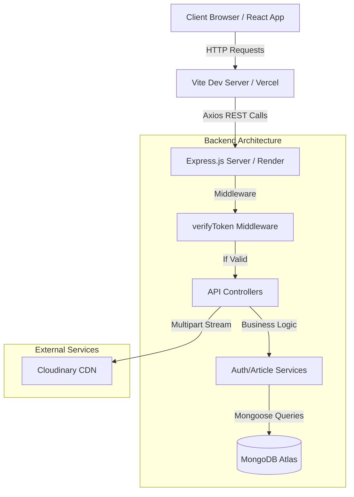

<div align="center">
  
# ✍️ Full-Stack Role-Based Blog Application

[](https://react.dev/)
[](https://nodejs.org/)
[](https://expressjs.com/)
[](https://www.mongodb.com/)
[](https://tailwindcss.com/)
[](https://vitejs.dev/)

A modern, responsive, and secure blogging platform built from the ground up with the **MERN Stack**. Designed with an enterprise-grade **Role-Based Access Control (RBAC)** architecture to deliver distinct experiences for Readers, Creators, and Administrators.


</div>

---

## 🌟 Executive Summary & Features

This platform goes beyond a simple CRUD application by implementing complex relationships, strict data validation, and stateless security.

### 🔐 Enterprise-Grade Security
- **Stateless JWT Sessions:** JSON Web Tokens are securely transmitted via `HTTP-Only` cookies, completely mitigating Cross-Site Scripting (XSS) vulnerabilities.
- **Data Encryption:** `bcryptjs` ensures passwords are never stored in plain text.
- **Middleware Guarding:** Every API endpoint and UI route is strictly guarded by role-verification middlewares.

### 👥 Three-Tier Role Architecture
| Role | Capabilities & Scope |
| :--- | :--- |
| **USER (Reader)** | Can view active articles, engage via comments, and manage personal profile credentials. |
| **AUTHOR (Creator)** | Access to a dedicated dashboard. Can write, edit, and "Soft Delete" (hide/restore) their own articles. Cannot affect others' content. |
| **ADMIN (Manager)** | Ultimate system oversight. Can view platform-wide analytics, forcefully block/unblock rogue users, and moderate (hide/restore) any article on the platform. |

### 📝 Advanced Content Management
- **Cloud Image Hosting:** Profile pictures are processed in-memory via `multer` and streamed directly to **Cloudinary**.
- **Soft Deletion:** Content is never permanently destroyed. Deactivated articles are hidden from the public feed but retained in the database for auditing and restoration.

---

## 📐 High-Level System Architecture



---

## 🏗️ Project Topology

This repository is structured as a monorepo, cleanly separating client and server concerns.

```text
blog-app/
├── frontend/       # React 19 Client (Zustand, Tailwind v4, React Router v7)
│   ├── README.md   # 📖 Detailed Frontend Architecture Documentation
│   └── src/        
└── backend/        # Node.js Server (Express, Mongoose, JWT, Multer)
    ├── README.md   # 📖 Detailed Backend Architecture Documentation
    └── ...         
```

---

## 📚 Deep-Dive Documentation

For a granular, 10/10 technical breakdown of how this system is engineered, please refer to the dedicated sub-readmes:

- 👉 **[Frontend Architecture Manual](./frontend/README.md)**: Explore the React 19 component tree, Zustand state hydration, dynamic Axios configuration, and React Router v7 protected layouts.
- 👉 **[Backend Architecture Manual](./backend/README.md)**: Explore the Express routing strategy, Mongoose Entity-Relationship schemas, strict validation rules, and exhaustive API endpoint definitions.

---

## 🚀 Quick Start (Local Development environment)

To run the entire application locally, you will need two terminal instances.

### 1. Initialize the Backend
```bash
cd backend
npm install
```
*CRITICAL: You must create a `.env` file in the `backend/` directory. See the [Backend README](./backend/README.md) for required keys (MongoDB, Cloudinary, JWT Secret).*
```bash
npm start
```
*Server boots on `http://localhost:4000`*

### 2. Initialize the Frontend Client
```bash
cd frontend
npm install
npm run dev
```
*Client boots on `http://localhost:5173`. The Axios configuration will automatically route API calls to your local backend.*

---
<div align="center">
  <i>Engineered with rigorous attention to detail, security, and scalability.</i>
</div>
