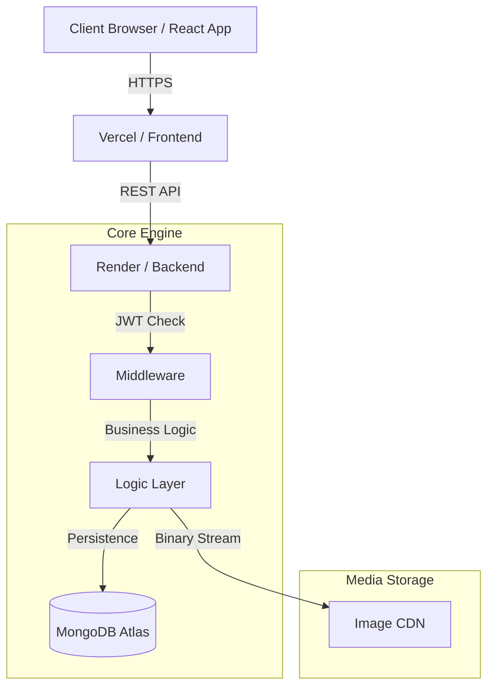

<div align="center">

# ✍️ Full-Stack Role-Based Blog Application (MERN)

[](https://react.dev/)
[](https://nodejs.org/)
[](https://expressjs.com/)
[](https://www.mongodb.com/)
[](https://tailwindcss.com/)
[](https://vitejs.dev/)

A modern, responsive, and secure blogging platform built with the **MERN Stack**. Designed with an enterprise-grade **Role-Based Access Control (RBAC)** architecture to deliver distinct experiences for Readers, Creators, and Administrators.

</div>

---

## 🌟 Executive Summary & Features

This platform goes beyond a simple CRUD application by implementing complex data relationships and stateless security paradigms.

### 🔐 Security & Access Control
- **Stateless Authentication:** Uses JWTs transmitted via secure `HTTP-Only` cookies.
- **Three-Tier Roles:** 
  - **USER:** Browse articles and comment.
  - **AUTHOR:** Write and manage personal articles via a dedicated dashboard.
  - **ADMIN:** Platform oversight, user moderation, and system analytics.

### 📝 Content & Media
- **Cloud-Native Media:** Profile images are streamed directly to **Cloudinary**.
- **Soft Deletion:** Articles can be deactivated without permanent data loss.
- **Interactive Feed:** Categorized discovery and nested commenting.

---

## 📐 System Architecture

The following diagram illustrates the high-level request flow and service integration across the stack.



---

## 🚀 Installation & How to Run

To set up this repository on a new machine, follow these steps:

### 1. Clone the Project
```bash
git clone https://github.com/Akhila-1703/blog-app.git
cd blog-app
```

### 2. Environment Setup (Backend)
Navigate to the `backend` folder and install dependencies:
```bash
cd backend
npm install
```
Create a `.env` file with your credentials (`DB_URL`, `JWT_SECRET_KEY`, `CLOUD_NAME`, `API_KEY`, `API_SECRET`).

### 3. Setup Frontend
Navigate to the `frontend` folder and install dependencies:
```bash
cd ../frontend
npm install
```

### 4. Run the Application
Open two terminal windows:
- **Terminal 1 (Backend):** `cd backend && npm start`
- **Terminal 2 (Frontend):** `cd frontend && npm run dev`

---

## 📚 Deep Dive Documentation

For folder-specific details including **Internal Project Structures**, **Package Evaluations**, and **Data Models**, please refer to:

- 📂 **[Backend Internal Docs](./backend/README.md)**: Features the **ER Database Model** and API Contracts.
- 📂 **[Frontend Internal Docs](./frontend/README.md)**: Features the **Component Topology** and State logic.

---
<div align="center">
  <i>Engineered for security, scalability, and performance.</i>
</div>
