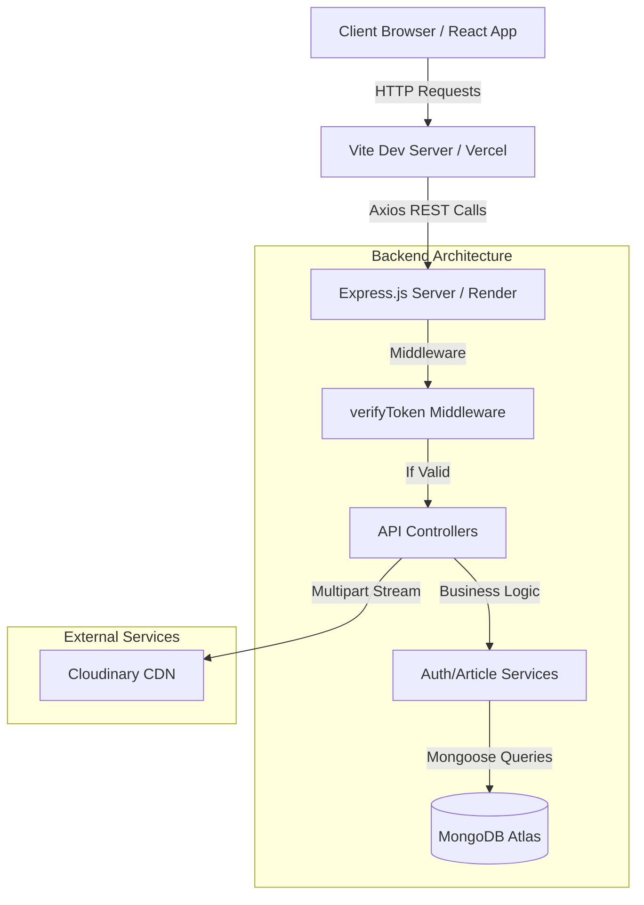
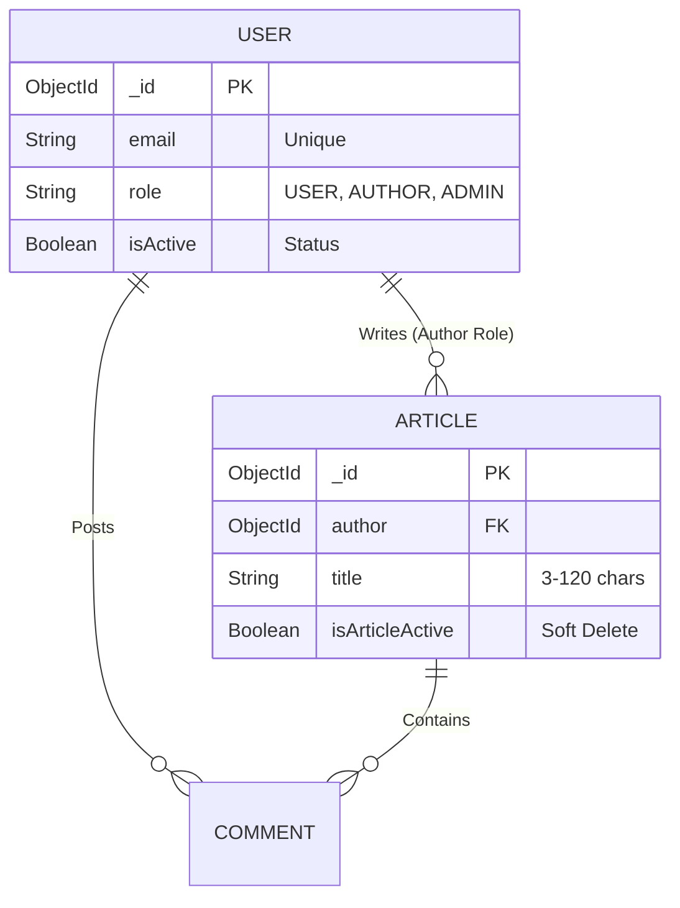

<div align="center">

# ✍️ Full-Stack Role-Based Blog Application (MERN)

[](https://react.dev/)
[](https://nodejs.org/)
[](https://expressjs.com/)
[](https://www.mongodb.com/)
[](https://tailwindcss.com/)
[](https://vitejs.dev/)

A modern, responsive, and secure blogging platform built with the **MERN Stack**. Designed with an enterprise-grade **Role-Based Access Control (RBAC)** architecture to deliver distinct experiences for Readers, Creators, and Administrators.

</div>

---

## 🌟 Features & Functionality

This platform implements complex data relationships, strict validation, and stateless security paradigms.

### 🔐 Security & Access Control
- **Stateless Authentication:** Uses JWTs transmitted via secure `HTTP-Only` cookies to prevent XSS.
- **Three-Tier Roles:** 
  - **USER (Reader):** Browse articles and engage with comments.
  - **AUTHOR (Creator):** Dedicated dashboard to write and manage personal articles.
  - **ADMIN (Manager):** Full platform oversight, user moderation, and system analytics.
- **Route Guarding:** Dynamic middleware and HOCs to protect sensitive API endpoints and UI layouts.

### 📝 Content Management
- **Cloud-Native Media:** Direct streaming of profile images to **Cloudinary** via `multer`.
- **Soft Deletion:** Article deactivation system that preserves data for auditing and restoration.
- **Interactive Feed:** Nested commenting system and categorized article discovery.

---

## 📐 System Architecture

### High-Level Flow


### Data Model (ER Diagram)


---

## 🚀 How to Use (Installation & Setup)

Follow these steps to get the project running on your local machine or another computer.

### 📋 Prerequisites
- **Node.js** (v18+)
- **MongoDB Atlas** Account (Cluster URI)
- **Cloudinary** Account (API Credentials)

### 1. Clone & Install Dependencies
```bash
git clone https://github.com/Akhila-1703/blog-app.git
cd blog-app

# Install Backend packages
cd backend
npm install

# Install Frontend packages
cd ../frontend
npm install
```

### 2. Environment Configuration
You must create a `.env` file inside the `backend/` directory with the following keys:
```env
PORT=4000
DB_URL=your_mongodb_atlas_uri
JWT_SECRET_KEY=your_secret_key
CLOUD_NAME=your_cloudinary_name
API_KEY=your_cloudinary_api_key
API_SECRET=your_cloudinary_api_secret
```

### 3. Running the Application
You will need two terminal windows open:

**Terminal 1 (Backend):**
```bash
cd backend
npm start
```
*Server runs on `http://localhost:4000`*

**Terminal 2 (Frontend):**
```bash
cd frontend
npm run dev
```
*Application accessible at `http://localhost:5173`*

---

## 📚 Detailed Documentation

For a deep dive into the internal project structure, file references, and specific package implementations, please refer to the folder-specific READMEs:

- 📂 **[Backend Internal Docs](./backend/README.md)**: Models, API Contracts, and Middleware logic.
- 📂 **[Frontend Internal Docs](./frontend/README.md)**: Components, State Management, and Protected Layouts.

---
<div align="center">
  <i>Engineered for security, scalability, and performance.</i>
</div>
