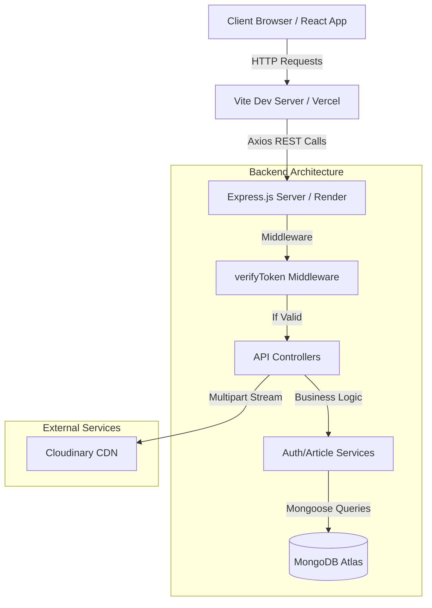
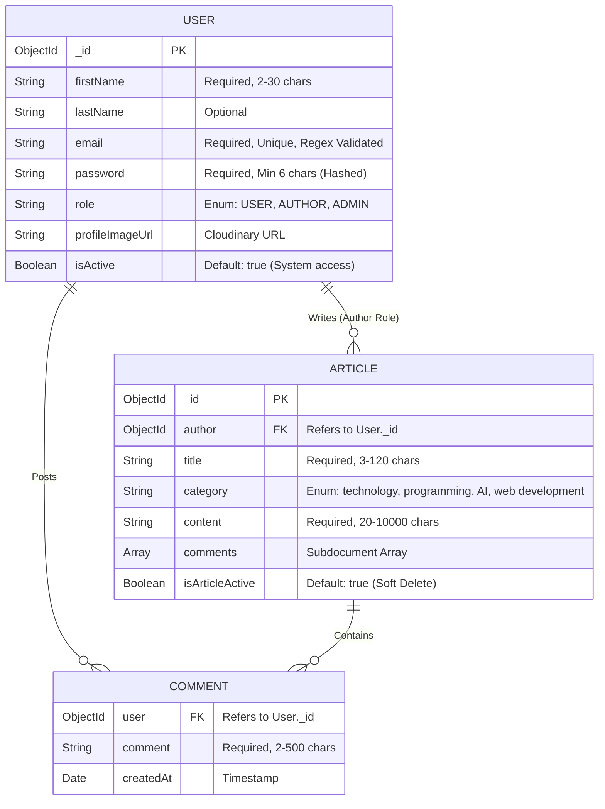

<div align="center">
  
# ✍️ Full-Stack Role-Based Blog Application (MERN)

[](https://react.dev/)
[](https://nodejs.org/)
[](https://expressjs.com/)
[](https://www.mongodb.com/)
[](https://tailwindcss.com/)
[](https://vitejs.dev/)

A modern, responsive, and secure blogging platform built from the ground up with the **MERN Stack**. Designed with an enterprise-grade **Role-Based Access Control (RBAC)** architecture to deliver distinct experiences for Readers, Creators, and Administrators.

</div>

---

## 🌟 Executive Summary & Features

This platform goes beyond a simple CRUD application by implementing complex relationships, strict data validation, and stateless security.

### 🔐 Enterprise-Grade Security
- **Stateless JWT Sessions:** JSON Web Tokens are securely transmitted via `HTTP-Only` cookies, completely mitigating Cross-Site Scripting (XSS) vulnerabilities.
- **Data Encryption:** `bcryptjs` ensures passwords are never stored in plain text.
- **Middleware Guarding:** Every API endpoint and UI route is strictly guarded by role-verification middlewares.
- **CORS Protection:** Restricted to specific frontend origins with `credentials: true`.

### 👥 Three-Tier Role Architecture
| Role | Capabilities & Scope |
| :--- | :--- |
| **USER (Reader)** | Can view active articles, engage via comments, and manage personal profile credentials. |
| **AUTHOR (Creator)** | Access to a dedicated dashboard. Can write, edit, and "Soft Delete" (hide/restore) their own articles. Cannot affect others' content. |
| **ADMIN (Manager)** | Ultimate system oversight. Can view platform-wide analytics, forcefully block/unblock rogue users, and moderate (hide/restore) any article on the platform. |

### 📝 Advanced Content Management
- **Cloud Image Hosting:** Profile pictures are processed in-memory via `multer` and streamed directly to **Cloudinary**.
- **Soft Deletion:** Content is never permanently destroyed. Deactivated articles are hidden from the public feed but retained in the database for auditing and restoration.
- **Interactive Comments:** Nested subdocument-based commenting system allowing users to engage with articles.

---

## 📐 High-Level System Architecture



---

## 📂 🏗️ Comprehensive Project Topology

This repository is structured as a **Monorepo**, cleanly separating client and server concerns for scalability and maintenance.

### Root Directory
```text
blog-app/
├── frontend/           # React 19 Client (Zustand, Tailwind v4, React Router v7)
├── backend/            # Node.js Server (Express, Mongoose, JWT, Multer)
├── docs/               # System documentation and diagrams
├── README.md           # 📖 Master Project Documentation
└── req.http            # HTTP test file for API exploration
```

### 1. Frontend Structure (`/frontend`)
```text
frontend/
├── src/
│   ├── assets/         # Static assets (images, icons)
│   ├── components/     # UI Components (Header, Footer, Dashboards, Forms)
│   │   ├── RootLayout.jsx      # Main layout shell
│   │   ├── ProtectedRoute.jsx   # Role-based gatekeeper
│   │   ├── Home.jsx             # Public landing page
│   │   ├── Login/Register.jsx   # Authentication views
│   │   ├── ...Dashboard.jsx     # Role-specific dashboard layouts
│   │   └── ArticleByID.jsx      # Article detail & comments
│   ├── config/         # API endpoint configurations
│   ├── store/          # Zustand state management (authStore.js)
│   ├── styles/         # Tailwind CSS common utility definitions (common.js)
│   ├── App.jsx         # Main router configuration (React Router v7)
│   ├── main.jsx        # App entry point
│   └── index.css       # Global styles & Tailwind imports
├── public/             # Static files served directly
├── package.json        # Frontend dependencies & scripts
└── vite.config.js      # Vite build configuration
```

### 2. Backend Structure (`/backend`)
```text
backend/
├── APIs/               # Express Router modules (User, Author, Admin, Common)
├── Models/             # Mongoose Schemas (User, Article)
├── Middlewares/        # JWT Verification & Upload handlers (multer)
├── Services/           # Complex business logic (authService)
├── database/           # MongoDB connection logic (db.js)
├── .env                # Environment variables (Sensitive)
├── server.js           # Server entry point & global error handling
└── package.json        # Backend dependencies & scripts
```

---

## 🗄️ 3. Entity-Relationship (ER) Data Model

The database is built on **MongoDB Atlas** using **Mongoose** to enforce a structured schema on top of a NoSQL foundation.

### Database Schema Visualization


---

## 📦 4. Technology Stack & Dependency Evaluation

### Backend Dependencies (`/backend/package.json`)
| Package | Version | Purpose & Strategic Use |
| :--- | :--- | :--- |
| `express` | `^5.2.1` | The backbone of the API. Chosen for its mature ecosystem and robust routing capabilities. |
| `mongoose` | `^9.1.5` | ODM for MongoDB. Provides validation, middleware, and simplified querying. |
| `jsonwebtoken` | `^9.0.3` | Implementation of secure, signed session tokens for stateless authentication. |
| `bcryptjs` | `^3.0.3` | Industry-standard password hashing algorithm (Blowfish) to ensure user security. |
| `multer` | `^2.1.1` | Middleware for handling `multipart/form-data`, used for efficient image uploads. |
| `cloudinary` | `^2.9.0` | Cloud-based asset management for storing and optimizing user profile images. |
| `cookie-parser` | `^1.4.7` | Critical for reading signed cookies to extract JWTs securely. |
| `cors` | `^2.8.6` | Enables secure cross-origin resource sharing between React and Express. |
| `dotenv` | `^17.2.3` | Manages environment variables to keep sensitive credentials out of source control. |

### Frontend Dependencies (`/frontend/package.json`)
| Package | Version | Purpose & Strategic Use |
| :--- | :--- | :--- |
| `react` | `^19.2.0` | Latest React engine with improved concurrent rendering and hooks support. |
| `react-router` | `^7.13.1` | Handles SPA routing, protected layouts, and dynamic URL parameters. |
| `zustand` | `^5.0.11` | Minimalistic state management for auth sessions, replacing the complexity of Redux. |
| `tailwindcss` | `^4.2.1` | Next-gen utility-first CSS framework for rapid and consistent UI development. |
| `axios` | `^1.13.6` | Promise-based HTTP client used to interact with the backend API. |
| `react-hook-form`| `^7.71.2` | High-performance form handling with validation and minimal re-renders. |
| `react-hot-toast` | `^2.6.0` | Elegant, lightweight notifications for user feedback (success/error). |

---

## 🚀 5. Installation & Comprehensive Setup

Follow these steps exactly to instantiate the platform in your local environment.

### Prerequisites
- **Node.js** (v18 or higher)
- **MongoDB Atlas** (Cluster URI)
- **Cloudinary Account** (API Key, Secret, Cloud Name)

### Step 1: Clone the Repository
```bash
git clone https://github.com/Akhila-1703/blog-app.git
cd blog-app
```

### Step 2: Backend Configuration
```bash
cd backend
npm install
```
Create a `.env` file in the `backend/` directory with the following variables:
```env
PORT=4000
DB_URL=your_mongodb_atlas_connection_string
JWT_SECRET_KEY=your_super_secret_key
CLOUD_NAME=your_cloudinary_name
API_KEY=your_cloudinary_api_key
API_SECRET=your_cloudinary_api_secret
```
**Start the Server:**
```bash
npm start
# Server will run on http://localhost:4000
```

### Step 3: Frontend Configuration
Open a **new terminal instance**:
```bash
cd frontend
npm install
```
**Start the Client:**
```bash
npm run dev
# Client will run on http://localhost:5173
```

---

## 🧠 6. Feature-Level Deep Dive

### Role-Based Access Control (RBAC) Logic
The application uses a dual-layer protection strategy:
1.  **Frontend Gatekeeping:** The `ProtectedRoute.jsx` component wraps dashboard routes and checks the role in the Zustand `authStore` before rendering.
2.  **Backend Verification:** Every sensitive API call is wrapped in a `verifyToken` middleware that validates the JWT in the cookie. Role-specific routers (`admin-api`, `author-api`) further restrict access based on the token payload.

### Soft Deletion Strategy
When an Author or Admin "deletes" an article:
- The database record **is not** removed.
- `isArticleActive` is set to `false`.
- This ensures data auditability and allows for instant restoration if needed.

### Image Processing Pipeline
1.  User selects a file in the Register form.
2.  React sends it via `FormData` to the backend.
3.  `multer` catches the file in memory buffer.
4.  The buffer is piped directly to `cloudinary` via its `upload_stream` API.
5.  Only the resulting secure URL is stored in the MongoDB User document.

---

## 📚 Technical Manuals
For granular documentation on specific layers, refer to:
- 👉 **[Frontend Architecture Manual](./frontend/README.md)**
- 👉 **[Backend Architecture Manual](./backend/README.md)**

---

<div align="center">
  <i>Engineered with rigorous attention to detail, security, and scalability. Designed as a production-ready template for modern blogging platforms.</i>
</div>
