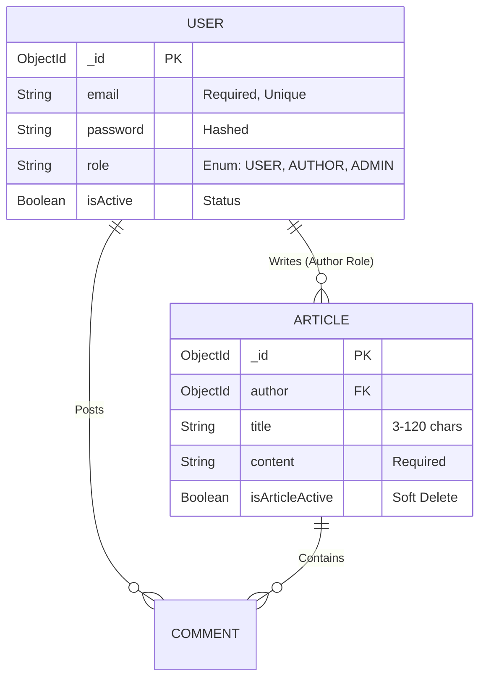

<div align="center">

# ⚙️ Backend Architecture & API Documentation

[](https://nodejs.org/)
[](https://expressjs.com/)
[](https://www.mongodb.com/)
[](https://mongoosejs.com/)

This document serves as the authoritative technical manual for the Blog Application backend. It details the internal engine: the data models, security paradigms, routing logic, and complete API contract.

</div>

---

## 🏗️ 1. Architecture & System Flow

This backend operates on a robust, highly modular **Node.js/Express** foundation designed for scalability and strict security.

- **Ingress & Security:** All incoming requests are filtered through CORS (restricted to specific frontend origins) and Cookie Parsers.
- **Stateless Auth Guard:** Protected routes are intercepted by the `verifyToken` middleware, which cryptographically validates JWTs stored in HTTP-Only cookies.
- **Controller-Service Split:** API Controllers (`*API.js`) handle HTTP lifecycles (req/res), delegating heavy business logic to Services (`authService.js`).
- **Data Integrity Layer:** Mongoose enforces strict schema rules *before* data touches MongoDB.
- **Global Error Sink:** A centralized error-handling middleware catches all thrown exceptions.

---

## 🚀 2. Local Installation & Setup

To run the backend server independently:

1. **Install Dependencies**:
   ```bash
   cd backend
   npm install
   ```
2. **Environment Configuration**:
   Create a `.env` file in this directory:
   ```env
   PORT=4000
   DB_URL=your_mongodb_uri
   JWT_SECRET_KEY=your_secret
   CLOUD_NAME=your_cloudinary_name
   API_KEY=your_cloudinary_api_key
   API_SECRET=your_cloudinary_api_secret
   ```
3. **Start the Server**:
   ```bash
   npm start
   ```

---

## 📂 3. Backend Project Structure
```text
backend/
├── APIs/               # Express Router modules (User, Author, Admin, Common)
├── Models/             # Mongoose Schemas (User, Article)
├── Middlewares/        # JWT Verification & Upload handlers (multer)
├── Services/           # Complex business logic (authService)
├── database/           # MongoDB connection logic (db.js)
├── .env                # Environment variables (Sensitive)
├── server.js           # Server entry point & global error handling
└── package.json        # Backend dependencies & scripts
```

---

## 📦 4. Complete Technology Stack & Dependencies

| Package | Version | Technical Implementation Details |
| :--- | :--- | :--- |
| `express` | `^5.2.1` | Core router. Uses `express.json()` and nested `express.Router()` modules. |
| `mongoose` | `^9.1.5` | ODM. Utilizes strict schemas and custom regex validators. |
| `jsonwebtoken`| `^9.0.3` | Generates HS256 signed tokens containing `_id`, `role`, and `email`. |
| `bcryptjs` | `^3.0.3` | Hashes passwords asynchronously. |
| `cookie-parser`| `^1.4.7` | Parses the secure `token` cookie set during login. |
| `multer` | `^2.1.1` | Intercepts `multipart/form-data` for image buffering. |
| `cloudinary` | `^2.9.0` | Cloud CDN for persistent image storage. |

---

## 🗄️ 5. Entity-Relationship (ER) Data Model

The backend data architecture is represented by the following model:



---

## 🌐 6. API Reference & Contracts

### 🟢 Common API (`/common-api`)
| Method | Endpoint | Auth | Purpose |
| :--- | :--- | :--- | :--- |
| `POST` | `/login` | None | Authenticates user and sets HTTP-Only cookie. |
| `GET` | `/check-auth` | None | Returns decoded JWT payload if cookie is valid. |

### 🔵 User API (`/user-api`)
| Method | Endpoint | Auth | Purpose |
| :--- | :--- | :--- | :--- |
| `GET` | `/articles` | USER | Fetches all active articles. |
| `PUT` | `/articles` | USER | Appends a comment to an article. |

### 🟠 Author API (`/author-api`)
| Method | Endpoint | Auth | Purpose |
| :--- | :--- | :--- | :--- |
| `POST` | `/articles` | AUTHOR | Creates a new article. |
| `PATCH`| `/articles/:id/status`| AUTHOR | Toggles `isArticleActive` (Soft Delete). |

### 🔴 Admin API (`/admin-api`)
| Method | Endpoint | Auth | Purpose |
| :--- | :--- | :--- | :--- |
| `PUT` | `/block-user` | ADMIN | Sets target user's `isActive: false`. |
| `GET` | `/stats` | ADMIN | Returns system-wide usage metrics. |

---
<div align="center">
  <i>Developed to strict architectural standards.</i>
</div>
