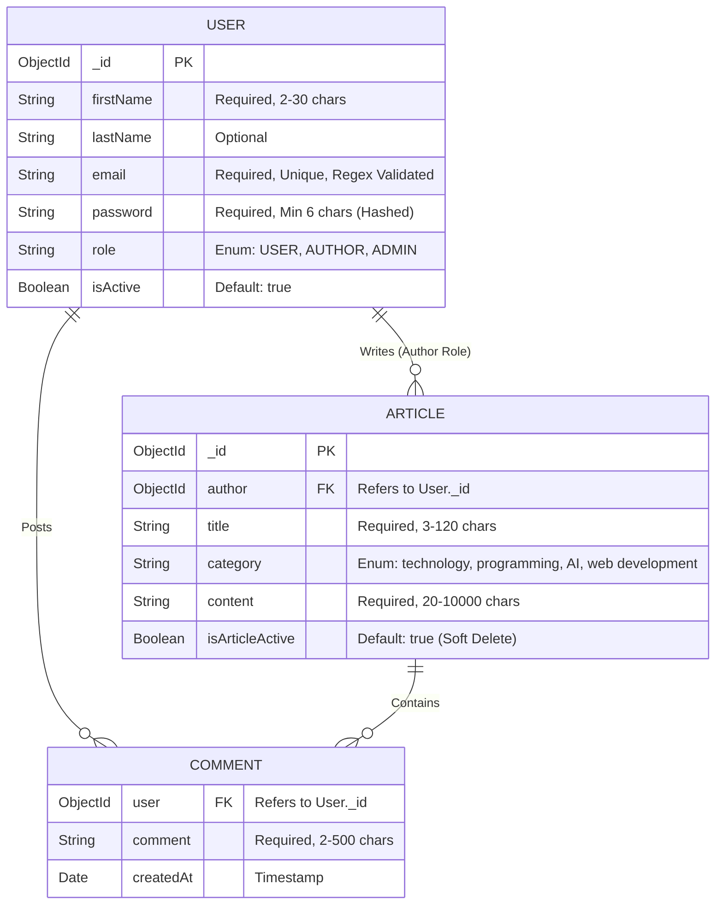

<div align="center">

# ⚙️ Backend Architecture & API Documentation

[](https://nodejs.org/)
[](https://expressjs.com/)
[](https://www.mongodb.com/)
[](https://mongoosejs.com/)

This document serves as the authoritative technical manual for the Blog Application backend. It details the internal engine: the data models, security paradigms, routing logic, and complete API contract.

</div>

---

## 🏗️ 1. Architecture & System Flow

This backend operates on a robust, highly modular **Node.js/Express** foundation designed for scalability and strict security.

- **Ingress & Security:** All incoming requests are filtered through CORS (restricted to specific frontend origins) and Cookie Parsers.
- **Stateless Auth Guard:** Protected routes are intercepted by the `verifyToken` middleware, which cryptographically validates JWTs stored in HTTP-Only cookies.
- **Controller-Service Split:** API Controllers (`*API.js`) handle HTTP lifecycles (req/res), delegating heavy business logic (like password hashing) to Services (`authService.js`).
- **Data Integrity Layer:** Mongoose enforces strict schema rules *before* data touches MongoDB.
- **Global Error Sink:** A centralized error-handling middleware catches all thrown exceptions, formatting Mongoose Validation/Cast errors into predictable, client-friendly JSON responses.

---

## 📦 2. Complete Technology Stack & Dependencies

| Package | Version | Technical Implementation Details |
| :--- | :--- | :--- |
| `express` | `^5.2.1` | Core router. Uses `express.json()` body parser and nested `express.Router()` modules. |
| `mongoose` | `^9.1.5` | ODM. Utilizes strict schemas, custom regex validators, and index creation (`email`, `author`). |
| `dotenv` | `^17.2.3` | Injected at line 1 of `server.js` to guarantee environment variables are available instantly. |
| `jsonwebtoken` | `^9.0.3` | Generates HS256 signed tokens containing `_id`, `role`, and `email`. Expires in 1 hour. |
| `bcryptjs` | `^3.0.3` | Hashes passwords asynchronously. Cost factor: 10 rounds for creation, 12 for updates. |
| `cookie-parser` | `^1.4.7` | Parses the secure `token` cookie set during the `/login` workflow. |
| `cors` | `^2.8.6` | Configured with `credentials: true` to allow cookies to traverse domains. |
| `multer` | `^2.1.1` | Intercepts `multipart/form-data`. Validates MIME types (`image/jpeg`, `image/png`) and buffers up to 2MB in RAM (`memoryStorage`). |
| `cloudinary` | `^2.9.0` | Cloud CDN. Buffers from Multer are piped directly to Cloudinary's `upload_stream` API. |

---

## 🗄️ 3. Entity-Relationship (ER) Data Model



*Note: In MongoDB, `COMMENT` is implemented as a Subdocument Array within the `ARTICLE` collection.*

---

## 🌐 4. API Reference & Contracts

### 🟢 Common API (`/common-api`)
*Universal Authentication flows.*

| Method | Endpoint | Auth | Purpose |
| :--- | :--- | :--- | :--- |
| `POST` | `/login` | None | Authenticates user and sets HTTP-Only JWT cookie. |
| `GET` | `/logout` | None | Instructs browser to clear the JWT cookie. |
| `PUT` | `/change-password`| ANY | Updates password for authenticated user. |
| `GET` | `/check-auth` | None | Returns decoded JWT payload if cookie is valid. |

**Example: `/login` Response Payload**
```json
{
  "message": "Login Success",
  "payload": {
    "_id": "64f1a2b3c4d5e6f7a8b9c0d1",
    "firstName": "John",
    "email": "john@example.com",
    "role": "AUTHOR",
    "isActive": true
  }
}
// Note: Password field is stripped via backend .toObject() manipulation.
```

### 🔵 User API (`/user-api`)
*Consumer workflows.*

| Method | Endpoint | Auth | Purpose |
| :--- | :--- | :--- | :--- |
| `POST` | `/users` | None | Registers a standard USER. Uses `multipart/form-data` for image. |
| `GET` | `/articles` | USER | Fetches all articles where `isArticleActive: true`. |
| `GET` | `/article/:id` | ANY | Fetches specific article. Populates `author` and `comments.user`. |
| `PUT` | `/articles` | USER | Appends a comment subdocument to an article. |

### 🟠 Author API (`/author-api`)
*Content creation workflows.*

| Method | Endpoint | Auth | Purpose |
| :--- | :--- | :--- | :--- |
| `POST` | `/users` | None | Registers an AUTHOR. Uses `multipart/form-data`. |
| `POST` | `/articles` | AUTHOR | Creates article. Sets `author` to `req.user._id`. |
| `GET` | `/articles` | AUTHOR | Fetches articles belonging **only** to logged-in author. |
| `PUT` | `/articles` | AUTHOR | Edits article. Validates ownership before update. |
| `PATCH`| `/articles/:id/status`| AUTHOR | Toggles `isArticleActive`. Validates ownership. |

### 🔴 Admin API (`/admin-api`)
*Platform moderation workflows.*

| Method | Endpoint | Auth | Purpose |
| :--- | :--- | :--- | :--- |
| `GET` | `/articles` | ADMIN | Fetches **all** articles (active and inactive). |
| `PUT` | `/block-user` | ADMIN | Sets target user's `isActive: false`. Cannot block self. |
| `PUT` | `/unblock-user` | ADMIN | Sets target user's `isActive: true`. |
| `PUT` | `/article-status` | ADMIN | Forcefully toggles any article's `isArticleActive` state. |
| `GET` | `/stats` | ADMIN | Returns counts: `totalUsers`, `totalAuthors`, `activeArticles`. |
| `GET` | `/users` | ADMIN | Returns array of all user documents (passwords stripped). |

---

## 🔒 5. Security & Error Handling Deep Dive

### The JWT & Cookie Architecture
We chose HTTP-Only cookies over `localStorage` to entirely eliminate XSS vulnerabilities. 
1. Server calls `jwt.sign()` and places it in `res.cookie()`.
2. `verifyToken` middleware reads `req.cookies.token`.
3. If valid, the decoded payload is appended to `req.user` for downstream controllers.

### Global Error Sink
The `server.js` file ends with an express error handler: `app.use((err, req, res, next) => {...})`.
- **Code 11000 (MongoDB Duplicate Key):** Intercepted and transformed into a `409 Conflict`.
- **ValidationError:** Intercepted and transformed into a `400 Bad Request` exposing exact schema violations.

---
<div align="center">
  <i>Developed to strict architectural standards.</i>
</div>
