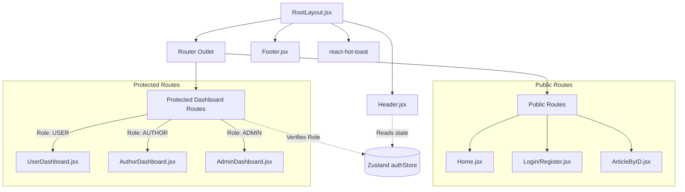

<div align="center">

# 🎨 Frontend Architecture & UI Documentation

[](https://react.dev/)
[](https://vitejs.dev/)
[](https://tailwindcss.com/)
[](https://zustand-demo.pmnd.rs/)

This document details the frontend implementation: a lightning-fast Single Page Application (SPA) utilizing modern React paradigms, utility-first CSS, and boilerplate-free state management.

</div>

---

## 🏗️ 1. Core Architecture & Routing State Machine

The frontend relies heavily on **React Router v7** for layout persistence and role-based route guarding. Global state (User Session) is hoisted into **Zustand**, allowing any component to subscribe to authentication changes without prop drilling.

### Routing & Component Topology



---

## 🚀 2. Local Installation & Setup

To run the frontend client independently:

1. **Install Dependencies**:
   ```bash
   cd frontend
   npm install
   ```
2. **Environment Configuration**:
   The frontend automatically detects the API base URL based on the environment. For local development, ensure your backend is running on `http://localhost:4000`.
3. **Start the Development Server**:
   ```bash
   npm run dev
   ```

---

## 📂 3. Frontend Project Structure
```text
frontend/
├── src/
│   ├── assets/         # Static assets (images, icons)
│   ├── components/     # UI Components (Header, Footer, Dashboards, Forms)
│   │   ├── RootLayout.jsx      # Main layout shell
│   │   ├── ProtectedRoute.jsx   # Role-based gatekeeper
│   │   ├── Home.jsx             # Public landing page
│   │   ├── Login/Register.jsx   # Authentication views
│   │   └── ArticleByID.jsx      # Article detail & comments
│   ├── config/         # API endpoint configurations (apiConfig.js)
│   ├── store/          # Zustand state management (authStore.js)
│   ├── styles/         # Tailwind CSS common utility definitions (common.js)
│   ├── App.jsx         # Main router configuration (React Router v7)
│   └── main.jsx        # App entry point
├── package.json        # Frontend dependencies & scripts
└── vite.config.js      # Vite build configuration
```

---

## 📦 4. Complete Technology Stack & Dependencies

| Package | Version | Purpose & Strategic Use |
| :--- | :--- | :--- |
| `react` | `^19.2.0` | Latest React engine with concurrent rendering. |
| `vite` | `^7.3.1` | Build tool replacing CRA for faster development. |
| `tailwindcss` | `^4.2.1` | Utility-first styling with responsive design support. |
| `react-router` | `^7.13.1` | Modern routing with layout outlets and loaders. |
| `zustand` | `^5.0.11` | Lightweight, hook-based state management. |
| `axios` | `^1.13.6` | HTTP client configured with `withCredentials: true`. |
| `react-hook-form`| `^7.71.2` | High-performance form handling with validation. |

---

## 🛡️ 5. Role-Based Route Guarding

The `<ProtectedRoute />` component is a Higher Order Component (HOC) that wraps sensitive dashboard routes. It extracts the `allowedRoles` array and compares it with the current user's role from the Zustand store, redirecting unauthorized access attempts instantly.

---
<div align="center">
  <i>Developed for maximum performance and UX.</i>
</div>
