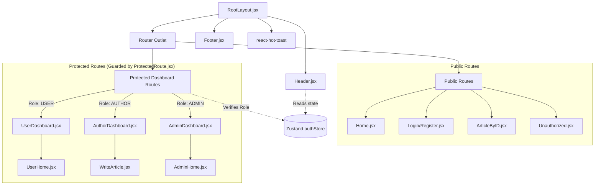

# 🎨 Frontend Architecture & UI Documentation

This document details the frontend implementation: a lightning-fast Single Page Application (SPA) utilizing modern React paradigms, utility-first CSS, and boilerplate-free state management.

---

## 🏗️ 1. Core Architecture & Routing State Machine

The frontend relies heavily on **React Router v7** for layout persistence and role-based route guarding. Global state (User Session) is hoisted into **Zustand**, allowing any component to subscribe to authentication changes without prop drilling.

### Routing & Component Topology

---

## 📦 2. Complete Technology Stack & Dependencies

| Package | Version | Technical Implementation Details |
| :--- | :--- | :--- |
| `react` & `dom` | `^19.2.0` | Uses modern hooks. `ErrorBoundary` wraps the router for graceful UI degradation on fatal JS errors. |
| `vite` | `^7.3.1` | Build tool. Replaces CRA/Webpack. Environment variables (`import.meta.env`) are used to switch API bases. |
| `tailwindcss` | `^4.2.1` | Utility classes injected directly into JSX. Responsive prefixes (`md:`, `lg:`) handle mobile-first design. |
| `react-router` | `^7.13.1` | Configured using the modern `createBrowserRouter` API. Enables nested layouts (e.g., persistent dashboards). |
| `zustand` | `^5.0.11` | Exposes `useAuthStore` hook. Contains `isAuth` boolean, `currentUser` object, and mutation functions (`login`, `logout`, `checkAuth`). |
| `react-hook-form` | `^7.71.2` | Uncontrolled form inputs. Handles validation for Auth forms and Article editors without causing expensive re-renders. |
| `axios` | `^1.13.6` | HTTP Client. **Critical:** Configured with `withCredentials: true` globally so that HTTP-Only JWT cookies are sent to the backend. |

---

## 🧠 3. State Management (Zustand) Deep Dive

Unlike Redux, Zustand provides a simplified, hook-based store. The `authStore.js` is the central brain of the client application.

**The `checkAuth` Lifecycle:**
1. Upon initial page load, `App.jsx` triggers `authStore.getState().checkAuth()`.
2. Axios hits `/common-api/check-auth` on the backend.
3. The backend reads the HTTP-Only cookie.
4. If valid, Zustand hydrates `currentUser` and sets `isAuth: true`.
5. *Result:* The user remains logged in across hard refreshes without exposing the JWT to client-side JavaScript.

---

## 📂 4. Exhaustive File & Directory Reference

Below is a complete, 100% accurate map of every file and folder in the frontend repository, along with its specific architectural purpose.

### Root Configurations
| File | Purpose |
| :--- | :--- |
| `package.json` | Core Node configuration defining dependencies and run scripts (`npm run dev`, `build`). |
| `package-lock.json` | Locks exact dependency versions to ensure consistent builds across environments. |
| `vite.config.js` | Vite bundler configuration. Mounts the `@vitejs/plugin-react` and `@tailwindcss/vite` plugins. |
| `eslint.config.js` | Modern "flat config" for ESLint, ensuring React hook rules (`eslint-plugin-react-hooks`) and fast refresh rules are enforced. |
| `index.html` | The single HTML file served to the browser. Contains the `

` where React mounts. |
| `vercel.json` | Deployment config. Instructs Vercel to rewrite all routes to `/index.html` (`"rewrites": [{"source": "/(.*)", "destination": "/"}]`), which is mandatory for React Router SPAs. |
| `.gitignore` | Prevents `node_modules/` and `dist/` from being pushed to Git. |

### `/public` and `/src/assets`
| File | Purpose |
| :--- | :--- |
| `public/vite.svg` | Static asset served directly at the root path (usually the favicon). |
| `src/assets/react.svg` | Static asset processed by Vite's asset pipeline, importable directly into React components. |

### Source Root (`/src`)
| File | Purpose |
| :--- | :--- |
| `main.jsx` | The React entry point. Calls `createRoot` and renders `<App />` surrounded by StrictMode. |
| `App.jsx` | The core router file. Uses `createBrowserRouter` to map URLs to specific layout and page components. Contains the `checkAuth` initialization logic. |
| `index.css` | The global stylesheet. Imports Tailwind via the `@import "tailwindcss";` directive. |

### Configuration & State (`/src/config` & `/src/store`)
| File | Purpose |
| :--- | :--- |
| `config/apiConfig.js` | Dynamically sets `API_BASE_URL`. If `import.meta.env.MODE === 'production'`, it targets the Render backend URL; otherwise, it targets `http://localhost:4000`. |
| `store/authStore.js` | The Zustand store. Defines `currentUser`, `isAuth`, and the async actions `login()`, `logout()`, and `checkAuth()` utilizing Axios. |

### Styling Utilities (`/src/styles`)
| File | Purpose |
| :--- | :--- |
| `styles/common.js` | A centralized dictionary of Tailwind CSS string variables (e.g., `primaryBtn`, `formCard`, `articleGrid`). This keeps component files extremely clean and ensures UI consistency across the entire app. |

### Components (`/src/components`)
#### 1. Core Layouts & Wrappers
| File | Purpose |
| :--- | :--- |
| `RootLayout.jsx` | The main UI shell. Renders the `<Header />`, the dynamic `<Outlet />`, the `<Footer />`, and the toast notification container. |
| `Header.jsx` | Dynamic navigation bar. Reads the user's role from Zustand to render appropriate Dashboard links and handles the logout click. |
| `Footer.jsx` | Standard UI footer. |
| `ProtectedRoute.jsx` | The security gatekeeper. An HOC that intercepts requests, checks the user's role against an `allowedRoles` prop, and redirects to `/login` or `/unauthorized` if conditions fail. |
| `ErrorBoundary.jsx` | Wraps the main router. Catches fatal React rendering errors and displays a friendly fallback UI instead of crashing the browser tab. |
| `Unauthorized.jsx` | The 403 Forbidden page displayed when a user attempts to access a restricted dashboard. |

#### 2. Public Views & Authentication
| File | Purpose |
| :--- | :--- |
| `Home.jsx` | The landing page of the application. |
| `Login.jsx` | Renders the login form using `react-hook-form` and triggers `authStore.login()`. |
| `Register.jsx` | Renders the registration form. Allows role selection (USER/AUTHOR) and profile image uploads via `FormData`. |

#### 3. User Dashboard
| File | Purpose |
| :--- | :--- |
| `UserDashboard.jsx` | Persistent layout wrapper for the `/user-dashboard/*` routes. |
| `UserHome.jsx` | The feed of all active articles for readers to browse. |
| `UserProfile.jsx` | Displays the user's details and contains the "Change Password" functionality. |

#### 4. Author Dashboard
| File | Purpose |
| :--- | :--- |
| `AuthorDashboard.jsx` | Persistent layout wrapper for the `/author-dashboard/*` routes. |
| `AuthorProfile.jsx` | Profile view specifically tailored for content creators. |
| `AuthorArticles.jsx` | Displays a filtered list of only the articles authored by the currently logged-in user. |
| `WriteArticle.jsx` | The article creation form utilizing `react-hook-form`. |
| `EditArticleForm.jsx` | The modification interface for existing articles, pre-hydrated with current data. |

#### 5. Admin Dashboard
| File | Purpose |
| :--- | :--- |
| `AdminDashboard.jsx` | Persistent layout wrapper for the `/admin-dashboard/*` routes. |
| `AdminHome.jsx` | The moderation control panel. Displays system stats, blocks/unblocks users, and forces articles to activate/deactivate. |
| `AdminProfile.jsx` | Profile view for the system administrator. |

#### 6. Shared Article Views
| File | Purpose |
| :--- | :--- |
| `ArticleByID.jsx` | The detailed article view accessible via `/article/:id`. Renders the full content, author info, and the interactive comment thread. |

---

## 🛡️ 5. Role-Based Route Guarding

The `<ProtectedRoute />` component is a Higher Order Component (HOC) that wraps sensitive dashboard routes.

**Logic Flow:**
1. Extracts `allowedRoles` array passed as a prop (e.g., `["AUTHOR"]`).
2. Reads current user role from Zustand.
3. **If not logged in:** Redirects `Navigate to="/login"`.
4. **If logged in but wrong role:** Redirects `Navigate to="/unauthorized"`.
5. **If valid:** Returns `<Outlet />` or `children`.

---

  <i>Developed for maximum performance and UX.</i>

