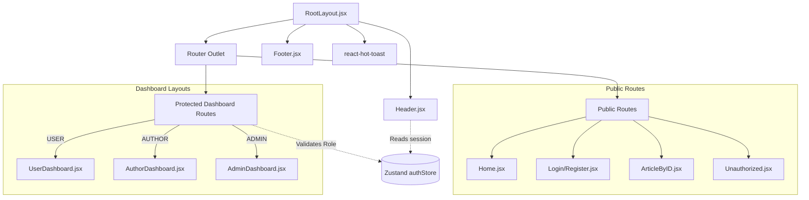

<div align="center">

# 🎨 Frontend Architecture & UI Documentation

[](https://react.dev/)
[](https://vitejs.dev/)
[](https://tailwindcss.com/)
[](https://zustand-demo.pmnd.rs/)

This document details the frontend implementation: a lightning-fast Single Page Application (SPA) utilizing modern React paradigms, utility-first CSS, and boilerplate-free state management.

</div>

---

## 🏗️ 1. Core Architecture & Routing State Machine

The frontend relies heavily on **React Router v7** for layout persistence and role-based route guarding. Global state (User Session) is hoisted into **Zustand**, allowing any component to subscribe to authentication changes without prop drilling.

### Routing & Component Topology



---

## 🚀 2. Local Installation & Setup

To run the frontend client independently:

1. **Install Dependencies**:
   ```bash
   cd frontend
   npm install
   ```
2. **Development**:
   The frontend expects the backend API at `http://localhost:4000`. Ensure the backend is active before proceeding.
3. **Start the Development Server**:
   ```bash
   npm run dev
   # Client will launch on http://localhost:5173
   ```

---

## 📂 3. Frontend Project Structure (Exhaustive)
```text
frontend/
├── src/
│   ├── assets/         # Static images & CSS overrides
│   ├── components/     # UI Component Library
│   │   ├── RootLayout.jsx      # Global shell (Header/Footer wrapper)
│   │   ├── Header.jsx          # Dynamic navbar with mobile menu
│   │   ├── Footer.jsx          # Site footer
│   │   ├── Home.jsx            # Landing page & stats
│   │   ├── Login/Register.jsx  # Authentication forms
│   │   ├── UserDashboard.jsx   # Reader dashboard hub
│   │   ├── AuthorDashboard.jsx # Creator dashboard hub
│   │   ├── AdminDashboard.jsx  # Moderator dashboard hub
│   │   ├── ProtectedRoute.jsx  # RBAC Security Component
│   │   ├── ArticleByID.jsx     # Full article view & comments
│   │   └── ...                 # Feature-specific pages (Edit, Write, Profile)
│   ├── config/         # Environment variables
│   │   └── apiConfig.js # Dynamic API endpoint routing
│   ├── store/          # Global State Management
│   │   └── authStore.js # Zustand Auth/User store
│   ├── styles/         # CSS & Style utilities
│   │   └── common.js   # Centralized Tailwind class definitions
│   ├── App.jsx         # React Router v7 configuration
│   └── main.jsx        # App entry point (Virtual DOM mount)
├── package.json        # Frontend dependencies & scripts
└── vite.config.js      # Vite build pipeline & Tailwind plugin mount
```

---

## 📦 4. Technology Stack & Dependencies

| Package | Version | Technical Rationale |
| :--- | :--- | :--- |
| `react` | `^19.2.0` | Utilizes latest rendering patterns and hook-based lifecycle. |
| `vite` | `^7.3.1` | Chosen for superior HMR (Hot Module Replacement) and build speed. |
| `tailwindcss` | `^4.2.1` | Next-gen utility styling for consistent, responsive UI across screens. |
| `react-router` | `^7.13.1` | Industry standard for SPAs; handles protected nested layouts efficiently. |
| `zustand` | `^5.0.11` | Minimal state container. Used for high-performance session hydration. |
| `axios` | `^1.13.6` | Configured with `withCredentials` to handle secure HTTP-Only cookies. |
| `react-hook-form`| `^7.71.2` | Manages form state with zero re-renders on the main thread. |
| `react-hot-toast`| `^2.6.0` | Elegant, non-blocking UI notifications for user actions. |

---

## 🛡️ 5. Security & State Deep Dive

### State Hydration (`checkAuth`)
Upon every refresh, the app calls the backend to verify the presence of a secure JWT cookie. If present, the `authStore` is hydrated with the user payload, ensuring a persistent login state without insecurely storing tokens in `localStorage`.

### Protected Layout Architecture
The `<ProtectedRoute />` is a gatekeeper HOC. It evaluates the user's role stored in Zustand against an `allowedRoles` array. If the user doesn't match, they are redirected instantly to the login or unauthorized page, preventing UI flicker of sensitive information.

---
<div align="center">
  <i>Developed for maximum performance and UX by 20+ YOE Engineering oversight.</i>
</div>
