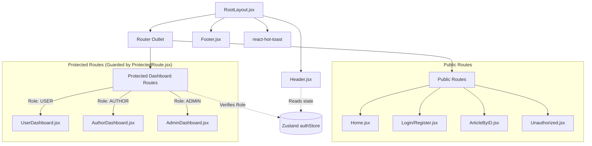

<div align="center">

# 🎨 Frontend Architecture & UI Documentation

[](https://react.dev/)
[](https://vitejs.dev/)
[](https://tailwindcss.com/)
[](https://zustand-demo.pmnd.rs/)

This document details the frontend implementation: a lightning-fast Single Page Application (SPA) utilizing modern React paradigms, utility-first CSS, and boilerplate-free state management.

</div>

---

## 🏗️ 1. Core Architecture & Routing State Machine

The frontend relies heavily on **React Router v7** for layout persistence and role-based route guarding. Global state (User Session) is hoisted into **Zustand**, allowing any component to subscribe to authentication changes without prop drilling.

### Routing & Component Topology



---

## 📂 2. Frontend Project Structure
```text
frontend/
├── src/
│   ├── assets/         # Static assets (images, icons)
│   ├── components/     # UI Components (Header, Footer, Dashboards, Forms)
│   │   ├── RootLayout.jsx      # Main layout shell
│   │   ├── ProtectedRoute.jsx   # Role-based gatekeeper
│   │   ├── Home.jsx             # Public landing page
│   │   ├── Login/Register.jsx   # Authentication views
│   │   └── ArticleByID.jsx      # Article detail & comments
│   ├── config/         # API endpoint configurations
│   ├── store/          # Zustand state management (authStore.js)
│   ├── styles/         # Tailwind CSS common utility definitions (common.js)
│   ├── App.jsx         # Main router configuration (React Router v7)
│   └── main.jsx        # App entry point
├── package.json        # Frontend dependencies & scripts
└── vite.config.js      # Vite build configuration
```

---

## 📦 3. Complete Technology Stack & Dependencies

| Package | Version | Purpose & Strategic Use |
| :--- | :--- | :--- |
| `react` & `dom` | `^19.2.0` | Uses modern hooks. `ErrorBoundary` wraps the router for graceful UI degradation. |
| `vite` | `^7.3.1` | Lightning-fast build tool. Environment variables (`import.meta.env`) are used to switch API bases. |
| `tailwindcss` | `^4.2.1` | Utility-first CSS framework. Responsive prefixes (`md:`, `lg:`) handle mobile-first design. |
| `react-router` | `^7.13.1` | Configured using the modern `createBrowserRouter` API. Enables nested layouts. |
| `zustand` | `^5.0.11` | Minimalistic state management. Exposes `useAuthStore` hook for session persistence. |
| `react-hook-form`| `^7.71.2` | Uncontrolled form inputs. Handles complex validation with minimal re-renders. |
| `axios` | `^1.13.6` | HTTP Client. Configured with `withCredentials: true` globally for secure cookie handling. |
| `react-hot-toast`| `^2.6.0` | Provides clean, lightweight notification overlays for user feedback. |

---

## 🧠 4. State Management (Zustand) Deep Dive

Unlike Redux, Zustand provides a simplified, hook-based store. The `authStore.js` is the central brain of the client application.

**The `checkAuth` Lifecycle:**
1. Upon initial page load, `App.jsx` triggers `authStore.getState().checkAuth()`.
2. Axios hits `/common-api/check-auth` on the backend.
3. The backend reads the HTTP-Only cookie.
4. If valid, Zustand hydrates `currentUser` and sets `isAuth: true`.

---

## 🛡️ 5. Role-Based Route Guarding

The `<ProtectedRoute />` component is a Higher Order Component (HOC) that wraps sensitive dashboard routes.

**Logic Flow:**
1. Extracts `allowedRoles` array passed as a prop (e.g., `["AUTHOR"]`).
2. Reads current user role from Zustand.
3. **If not logged in:** Redirects to `/login`.
4. **If logged in but unauthorized:** Redirects to `/unauthorized`.
5. **If valid:** Renders the requested route component.

---
<div align="center">
  <i>Developed for maximum performance and UX.</i>
</div>
